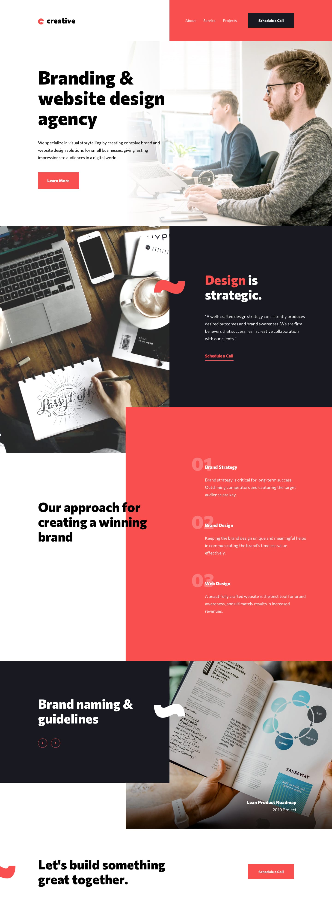
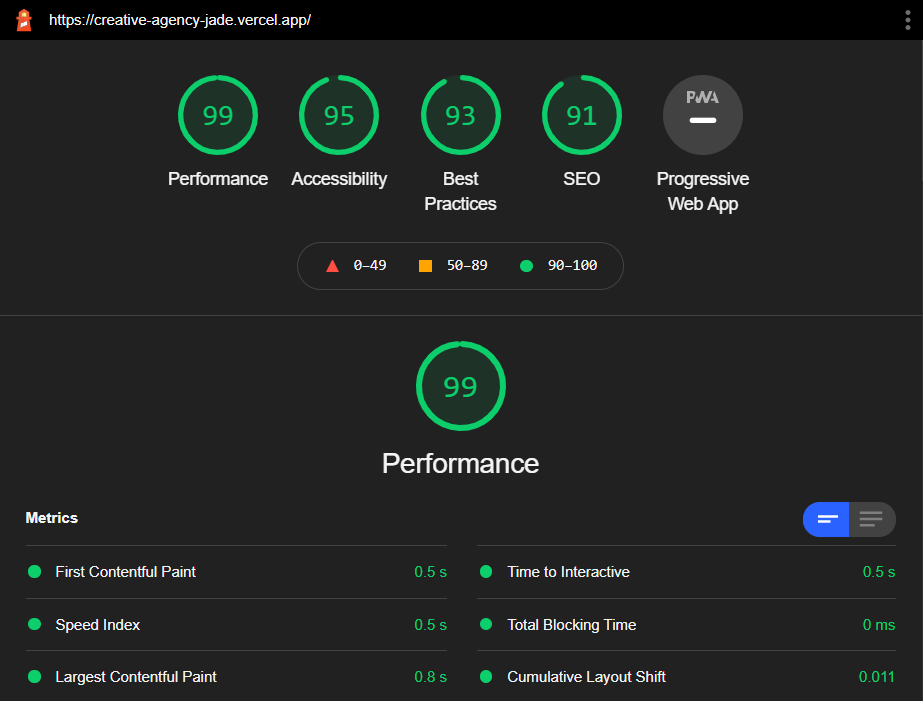

# CREATIVE AGENCY - FRONTENDMENTOR CHALLENGE

[Creative Agency](https://creative-agency-jade.vercel.app) is a single page website submitted for a challenge on [Frontendmentor](https://www.frontendmentor.io/).

## Design

## Written In

- React
- React Hooks
- Typescript
- CSS modules

## Code Highlights

- Responsive design across wide range of viewports
- Modular CSS
- Small reuseable component design
- Consistent design pattern
- Used Transition best practises for optimal performance

## Lighthouse Performance

## Run Locally

1. Install node.js and npm
1. Clone the repository using `git clone https://github.com/naveen-27/creative-agency.git`
1. Change to cloned repository using `cd creative-agency`
1. Install dependencies using `npm install`
1. Run locally using `npm start`
